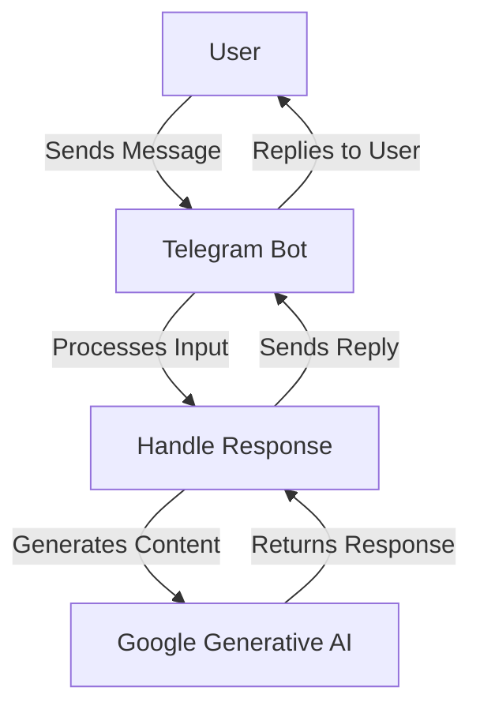

# AI Companion Telegram Bot

This Telegram bot leverages Google Generative AI to provide a friendly and engaging experience for users, particularly older adults. The bot can engage in conversation, offer support, and stimulate mental activities like trivia and word games.

## Features

- Friendly conversation starter
- Generates responses using Google Generative AI
- Engages users in interactive discussions
- Provides companionship and mental stimulation

## Technologies Used

- **Telegram Bot API**: For bot functionalities
- **Google Generative AI**: For generating responses
- **Python**: Programming language

## Diagram



## Installation

1. **Clone the repository**:
   ```bash
   git clone https://github.com/yourusername/ai-companion-bot.git
   cd ai-companion-bot
   ```

2. **Install required packages**:
   ```bash
   pip install python-telegram-bot google-generative-ai
   ```

3. **Set up your API keys**:
   - Replace `YOUR_GOOGLE_API_KEY` in the code with your actual Google API key.
   - Replace `YOUR_TELEGRAM_BOT_API_TOKEN` in the code with your Telegram bot API token.

## Usage

1. **Run the bot**:
   ```bash
   python bot.py
   ```

2. **Start chatting**:
   - Open Telegram and search for your bot using its username.
   - Send `/start` to initiate conversation.

## Command Reference

- **/start**: Initiates conversation with the bot.

## Contributing

Contributions are welcome! Feel free to open issues or submit pull requests.

1. Fork the repository.
2. Create your feature branch (`git checkout -b feature/AmazingFeature`).
3. Commit your changes (`git commit -m 'Add some feature'`).
4. Push to the branch (`git push origin feature/AmazingFeature`).
5. Open a pull request.

## License

This project is licensed under the MIT License - see the [LICENSE](LICENSE) file for details.

## Acknowledgments

- [Google Generative AI](https://cloud.google.com/generative-ai)
- [Telegram Bot API](https://core.telegram.org/bots/api)

